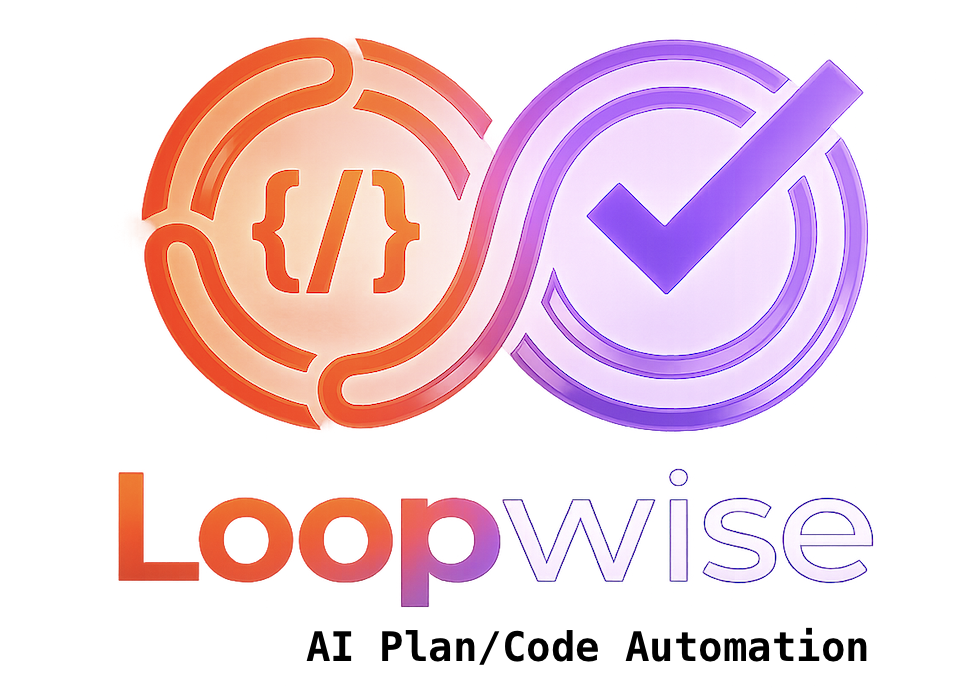

[English](README.md)

<div align="center">
  
</div>

# loopwise

Claude Code 与 Codex CLI 之间的自动化 review 循环。

Claude Code 生成计划或代码，Codex 自动审查，反馈回传给 Claude Code 进行修改，循环往复直到 Codex 批准通过。

## 工作原理

```
┌─────────────┐    计划/代码        ┌─────────────┐
│ Claude Code │ ─────────────────→ │   Codex     │
│  （生成）    │                    │  （审查）     │
│             │ ←───────────────── │             │
│  （修改）    │      反馈           │             │
└─────────────┘                    └─────────────┘
       ↑                                 │
       └──── 循环直到 APPROVED ───────────┘
```

每一轮：
1. Claude Code 生成输出（计划或代码）
2. Codex 通过 `codex exec` 按质量标准审查
3. 如果 Codex 输出 APPROVED，循环结束
4. 否则，反馈回传给 Claude Code 进行修改
5. 重复直到通过或达到最大轮数

## 前置要求

```bash
npm install -g @anthropic-ai/claude-code   # Claude Code CLI
npm install -g @openai/codex               # Codex CLI
brew install jq                            # JSON 处理器（独立模式需要）
```

## 两种使用方式

### 方式一：在 Claude Code 内使用斜杠命令（推荐）

在任何 Claude Code 会话中直接使用 `/loopwise`，只需复制命令文件即可：

```bash
# 安装斜杠命令（一次性设置）
cp .claude/commands/loopwise.md ~/.claude/commands/

# 或者克隆后复制
git clone https://github.com/haohappy/loopwise.git
cp loopwise/.claude/commands/loopwise.md ~/.claude/commands/
```

然后在 Claude Code 会话中：

```
# 从 prompt 生成，然后进入 review 循环
> /loopwise plan Design a REST API for user management with JWT auth
> /loopwise code Implement a rate limiter middleware for Express

# 审查已有文件
> /loopwise plan --file docs/plan.md
> /loopwise code --file src/auth.ts

# 审查已有文件并附加指令
> /loopwise plan --file docs/plan.md 补充错误处理细节
> /loopwise code --file src/auth.ts 重构为中间件模式

# 审查当前对话中刚写的内容（不传参数）
> /loopwise plan
> /loopwise code
```

这是最方便的方式 — Claude Code 直接在当前会话中驱动循环，调用 Codex 审查、读取反馈、就地修改，无需额外进程。

### 方式二：独立 shell 命令

从终端作为独立进程运行：

```bash
# 安装
git clone https://github.com/haohappy/loopwise.git
cd loopwise
./install.sh            # 安装到 /usr/local/bin
# 或: ./install.sh ~/bin

# 使用
loopwise plan "构建一个带 JWT 认证的用户管理 REST API"
loopwise code "实现一个 Express 限流中间件"
loopwise plan --file docs/plan.md
loopwise code --file src/auth.ts "重构为使用 passport.js"
loopwise plan --max-rounds 10 --verbose "设计一个实时通知系统"
```

## 默认模型

- **Claude Code**：Claude Opus 4.6（用于计划/代码生成和修改）
- **Codex**：GPT-5.4（用于审查）

## 配置

通过 CLI 参数或环境变量配置：

| 参数 | 环境变量 | 默认值 | 说明 |
|---|---|---|---|
| `--max-rounds` | `LOOPWISE_MAX_ROUNDS` | *（无限制）* | 最大 review 轮数（0 = 不限） |
| `--claude-model` | `LOOPWISE_CLAUDE_MODEL` | Claude Opus 4.6 | Claude 生成模型 |
| `--codex-model` | `LOOPWISE_CODEX_MODEL` | GPT-5.4 | Codex 审查模型 |
| `--output-dir` | `LOOPWISE_OUTPUT_DIR` | .loopwise | 会话产物目录 |
| `--timeout` | `LOOPWISE_TIMEOUT` | 300 | 每次 CLI 调用超时（秒） |
| `--verbose` | `LOOPWISE_VERBOSE` | false | 显示调试输出 |

## 产物输出

每次会话在 `.loopwise/` 下创建一个带时间戳的目录：

```
.loopwise/
  20260329_143022_12345/
    round_1_claude.md           # 初始生成
    round_2_codex_review.md     # 第一轮审查
    round_2_claude_revised.md   # 第一轮修改
    round_3_codex_review.md     # 第二轮审查
    final.md                    # 最终版本
    status.txt                  # APPROVED 或 MAX_ROUNDS_REACHED
```

## Review 历史

使用 `--file` 审查文件时，工具会基于文件内容的 SHA-256 哈希自动追踪 review 历史（`.loopwise/history.json`）：

- **文件未变 + 已通过** → 自动跳过，提示"文件未修改，之前已通过审查"
- **文件未变 + 上次未通过** → 提示可以继续上次的反馈，或重新开始
- **文件已变** → 正常开始新一轮 review
- **强制重新审查**：使用 `--force` 跳过历史检查

## 使用建议

- **计划审查**：提供详细的需求描述，让 Claude Code 生成完整的计划，Codex 才有足够的上下文进行评估。
- **代码审查**：使用 `--file` 指向具体文件，进行聚焦审查。
- **审查严格度**：编辑 `loopwise.sh` 中的 review prompt 来调节 Codex 的审查标准。可以更严格（"只有完全没有问题才能通过"）或更宽松（"整体方案合理即可通过"）。
- **成本控制**：使用 `LOOPWISE_CODEX_MODEL=gpt-4.1-mini` 或 `LOOPWISE_MAX_ROUNDS=3` 来降低实验阶段的 API 开销。

## 许可证

MIT
